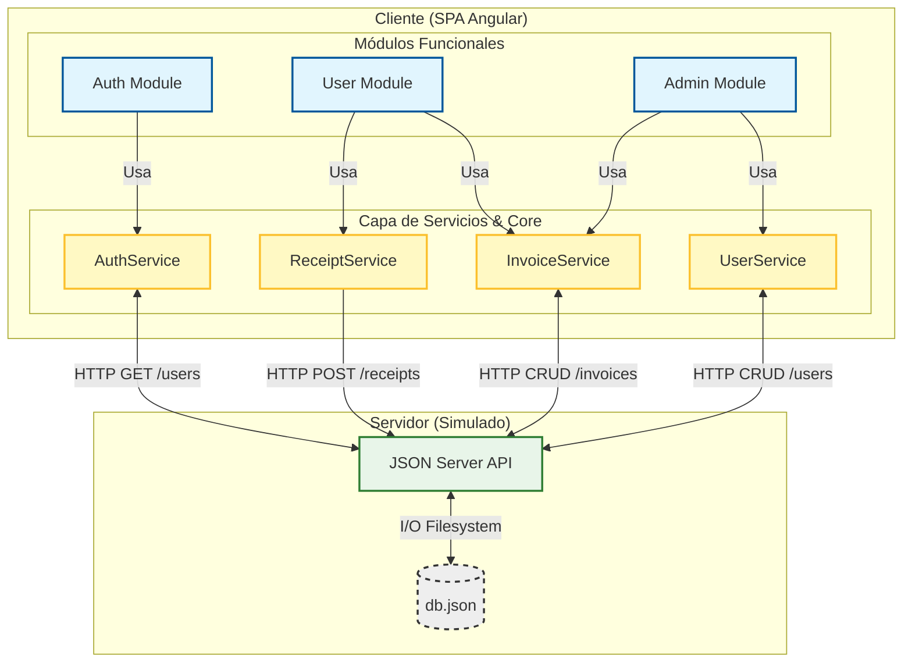

# Diagrama de Arquitectura del Sistema

Este documento define la estructura de alto nivel y los flujos de comunicación del sistema **Bill Payment**.

```mermaid
graph TD
    %% Estilos
    classDef module fill:#e1f5fe,stroke:#01579b,stroke-width:2px;
    classDef service fill:#fff9c4,stroke:#fbc02d,stroke-width:2px;
    classDef backend fill:#e8f5e9,stroke:#2e7d32,stroke-width:2px;
    classDef db fill:#eee,stroke:#333,stroke-width:2px,stroke-dasharray: 5 5;

    subgraph Client ["Cliente (SPA Angular)"]
        direction TB
        
        subgraph Modules ["Módulos Funcionales"]
            direction TB
            AuthMod["Auth Module"]:::module
            UserMod["User Module"]:::module
            AdminMod["Admin Module"]:::module
        end

        subgraph Services ["Capa de Servicios & Core"]
            AuthServ["AuthService"]:::service
            InvServ["InvoiceService"]:::service
            UserServ["UserService"]:::service
            ReceiptServ["ReceiptService"]:::service
        end
    end

    subgraph Server ["Servidor (Simulado)"]
        JSONServer["JSON Server API"]:::backend
        DB[("db.json")]:::db
    end

    %% Relaciones entre Módulos y Servicios
    AuthMod -->|Usa| AuthServ
    UserMod -->|Usa| InvServ
    UserMod -->|Usa| ReceiptServ
    AdminMod -->|Usa| UserServ
    AdminMod -->|Usa| InvServ

    %% Comunicación HTTP
    AuthServ <-->|HTTP GET /users| JSONServer
    InvServ <-->|HTTP CRUD /invoices| JSONServer
    UserServ <-->|HTTP CRUD /users| JSONServer
    ReceiptServ -->|HTTP POST /receipts| JSONServer

    %% Persistencia
    JSONServer <-->|I/O Filesystem| DB
```
