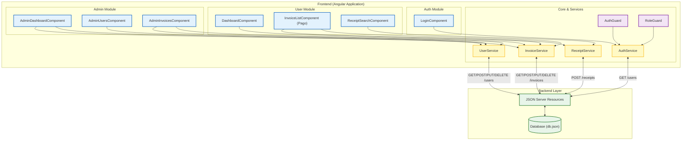

# Diagrama de Componentes del Sistema

```mermaid
graph TD
    %% Estilos
    classDef component fill:#e3f2fd,stroke:#1565c0,stroke-width:2px;
    classDef service fill:#fff9c4,stroke:#fbc02d,stroke-width:2px;
    classDef guard fill:#f3e5f5,stroke:#7b1fa2,stroke-width:2px;
    classDef backend fill:#e8f5e9,stroke:#2e7d32,stroke-width:2px;

    subgraph Frontend ["Frontend (Angular Application)"]
        direction TB

        subgraph Core ["Core & Services"]
            AuthService["AuthService"]:::service
            UserService["UserService"]:::service
            InvService["InvoiceService"]:::service
            ReceiptService["ReceiptService"]:::service
            AuthGuard["AuthGuard"]:::guard
            RoleGuard["RoleGuard"]:::guard
        end

        subgraph AuthMod ["Auth Module"]
            LoginComp["LoginComponent"]:::component
        end

        subgraph UserMod ["User Module"]
            UserDash["DashboardComponent"]:::component
            InvList["InvoiceListComponent (Pago)"]:::component
            ReceiptComp["ReceiptSearchComponent"]:::component
        end

        subgraph AdminMod ["Admin Module"]
            AdminDash["AdminDashboardComponent"]:::component
            AdminUsers["AdminUsersComponent"]:::component
            AdminInvoices["AdminInvoicesComponent"]:::component
        end
    end

    subgraph Backend ["Backend Layer"]
        JsonServer["JSON Server Resources"]:::backend
        DB[("Database (db.json)")]:::backend
    end

    %% Internal Dependencies - Auth
    LoginComp --> AuthService
    AuthGuard --> AuthService
    RoleGuard --> AuthService

    %% Internal Dependencies - User
    UserDash --> InvService
    InvList --> InvService
    InvList --> ReceiptService
    ReceiptComp --> ReceiptService

    %% Internal Dependencies - Admin
    AdminDash --> InvService
    AdminDash --> UserService
    AdminUsers --> UserService
    AdminInvoices --> InvService
    AdminInvoices --> UserService

    %% Service -> Backend Communication
    AuthService <-->|GET /users| JsonServer
    UserService <-->|GET/POST/PUT/DELETE /users| JsonServer
    InvService <-->|GET/POST/PUT/DELETE /invoices| JsonServer
    ReceiptService <-->|POST /receipts| JsonServer

    %% Backend internal
    JsonServer <--> DB
```
