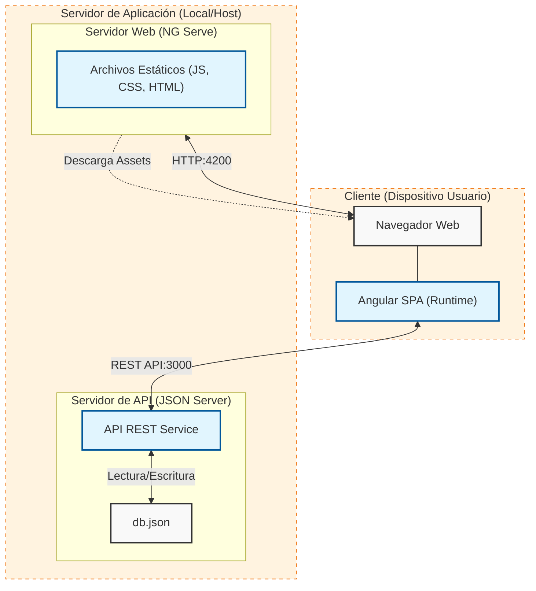

# Diagrama de Despliegue

```mermaid
graph TB
    %% Estilos
    classDef node fill:#f9f9f9,stroke:#333,stroke-width:2px;
    classDef comp fill:#e1f5fe,stroke:#01579b;
    classDef env fill:#fff3e0,stroke:#ef6c00,stroke-dasharray: 5 5;

    subgraph ClientEnv ["Cliente (Dispositivo Usuario)"]
        direction TB
        Browser["Navegador Web"]:::node
        SPA["Angular SPA (Runtime)"]:::comp
        Browser --- SPA
    end

    subgraph Host ["Servidor de Aplicación (Local/Host)"]
        direction TB
        
        subgraph StaticServer ["Servidor Web (NG Serve)"]
            direction TB
            Assets["Archivos Estáticos (JS, CSS, HTML)"]:::comp
        end

        subgraph APIServer ["Servidor de API (JSON Server)"]
            direction TB
            MockAPI["API REST Service"]:::comp
            Storage["db.json"]:::node
        end
    end

    %% Conexiones
    Browser <-->|HTTP:4200| StaticServer
    StaticServer -.->|Descarga Assets| Browser
    SPA <-->|REST API:3000| MockAPI
    MockAPI <-->|Lectura/Escritura| Storage

    %% Clases de entorno
    class ClientEnv,Host env;
```
