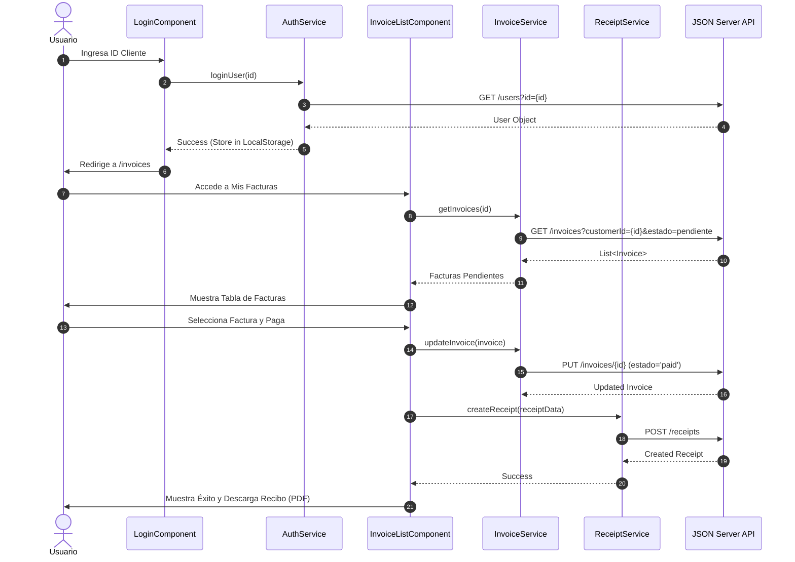

# Diagrama de Secuencia: Pago de Factura (Happy Path)

```mermaid
sequenceDiagram
    autonumber
    actor U as Usuario
    participant LC as LoginComponent
    participant AS as AuthService
    participant IL as InvoiceListComponent
    participant IS as InvoiceService
    participant RS as ReceiptService
    participant API as JSON Server API

    %% Flujo de Autenticación
    U->>LC: Ingresa ID Cliente
    LC->>AS: loginUser(id)
    AS->>API: GET /users?id={id}
    API-->>AS: User Object
    AS-->>LC: Success (Store in LocalStorage)
    LC->>U: Redirige a /invoices

    %% Consulta de Facturas
    U->>IL: Accede a Mis Facturas
    IL->>IS: getInvoices(id)
    IS->>API: GET /invoices?customerId={id}&estado=pendiente
    API-->>IS: List<Invoice>
    IS-->>IL: Facturas Pendientes
    IL->>U: Muestra Tabla de Facturas

    %% Proceso de Pago
    U->>IL: Selecciona Factura y Paga
    IL->>IS: updateInvoice(invoice)
    IS->>API: PUT /invoices/{id} (estado='paid')
    API-->>IS: Updated Invoice
    IL->>RS: createReceipt(receiptData)
    RS->>API: POST /receipts
    API-->>RS: Created Receipt
    RS-->>IL: Success
    IL->>U: Muestra Éxito y Descarga Recibo (PDF)
```
